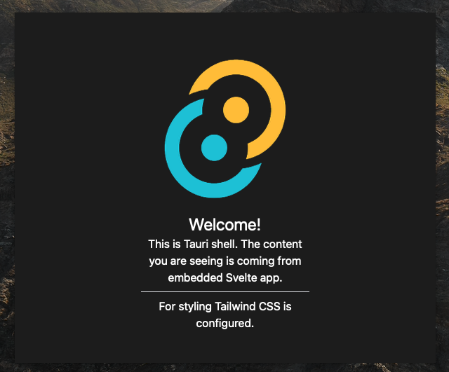

# Tauri Shell

This repo can be used as reference for building alfred/raycast/spotlight apps using Tauri.

## Usage

This reference repository is using Svelte for the content shown inside the window. But any framework (React, Vue, etc.) can also be used just as easily.

For example, to use this with React:

1. Create a React project (e.g., with `create-react-app`)
2. Copy the `src-tauri/` into your React project root. 
3. Update the `build.distDir` key in `src-tauri/tauri.conf.json` file to `../build` (Becuase React generates production build in `build/`)

